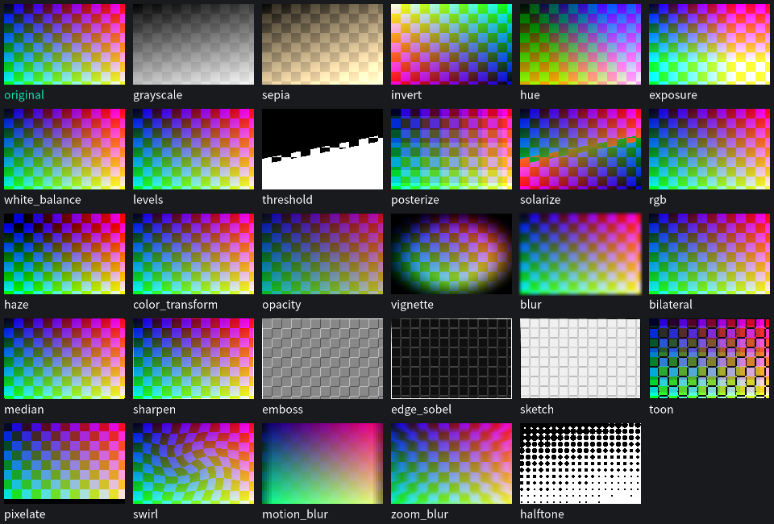
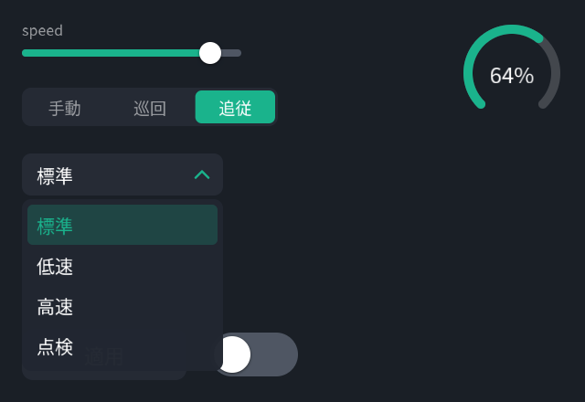

# fluent_scene

English | **[日本語](README.ja.md)**

by **[@takatronix](https://x.com/takatronix)** · MIT licensed


**Write a screen once — get the same pixels on robots, in browsers, in apps.**

fluent_scene is a 2D compositing engine built on a CALayer-style retained
layer tree and SDF rendering. Declare camera feeds, detections, HUDs, and UI
in logical coordinates; three backends — CPU, Vulkan, and WebGPU — render
them **pixel-identically** (a golden-image contract; measured max|Δ|=1).

```
Scene (declarative .fvs/YAML) → Stage (runtime tree, C++) → Surface (pixels)
```

## Live demos — in your browser, right now

Everything below runs as a wasm build on
[GitHub Pages](https://takatronix.github.io/fluent_scene/). There is no
server-side processing; video never leaves your tab.

| Demo | What it shows |
|---|---|
| [filter studio](https://takatronix.github.io/fluent_scene/edit.html) | Node-graph compositor — stack multiple inputs with rotation/blend, split person from background (MediaPipe → layer mask) to style each side separately, tune all 47 filters; ask the AI for "old camcorder footage" or "ink-wash the background only" and watch it wire itself (built-in offline composer, or your own Claude / OpenAI-compatible key — stored in localStorage only). Share links & Scene YAML export |
| [filter lab](https://takatronix.github.io/fluent_scene/filters.html) | All 47 filters on the live webcam, one chip each — the single-source GLSL∩C++ catalog, live |
| [Playground](https://takatronix.github.io/fluent_scene/) | The whole library running locally in a tab (CPU wasm, portrait effects) |
| [beauty](https://takatronix.github.io/fluent_scene/beauty.html) | Beauty filter — variance-gated skin smoothing, skin-scoped whitening, 3D LUT; webcam wipe comparison |
| [lsd](https://takatronix.github.io/fluent_scene/lsd.html) | The LSD filter — time-driven psychedelia, closed-eye visuals via webcam ([how it works](https://takatronix.github.io/fluent_scene/lsd_report.html)) |
| [gaze](https://takatronix.github.io/fluent_scene/gaze.html) | Gaze focus — a MediaPipe landmarker driving Scene parameters |
| [anime](https://takatronix.github.io/fluent_scene/anime.html) | Anime face — face-lock crop → AnimeGANv3 in-browser (WebGPU fp16) → feathered paste-back. Weights are **non-commercial** ([license](wasm/dist/models/LICENSE.txt)) |
| [webgpu](https://takatronix.github.io/fluent_scene/webgpu.html) | Backend verification — one scene rendered by CPU and WebGPU, compared per pixel |

## Three ways to write it, one picture

**C++ (Stage API)** — robots, desktops, embedded:

```cpp
Stage stage(1920, 1080);
stage.image(camera);
stage.boxes(detections).color(Color::Teal).smoothing(0.2f);
stage.group("hud").position(24, 24).shadow()
     .rect({0, 0, 340, 96}).cornerRadius(12).color({0, 0, 0, 0.45f});
renderer->render(stage, dt);   // same pixels on CPU and Vulkan
```

**YAML (Scene documents)** — editable by humans and by AI. Type checking,
reference resolution, and digests all run before execution, so **an AI can
safely generate and edit a live screen**:

```yaml
layers:
  - content: { image: { source: $inputs.camera } }
  - content: { boxes: { source: $inputs.detections, smoothing: 0.2 } }
  - id: hud
    position: [24, 24]
    shadow: {}
    sublayers:
      - content: { rect: { size: [340, 96], corner_radius: 12,
                           color: [0, 0, 0, 0.45] } }
```

**JavaScript (wasm)** — one ES module for web apps:

```js
import createFluentScene from './fluent_scene.mjs';
const mod = await createFluentScene();
const inst = mod.cwrap('fs_create', 'number', ['number'])(
    mod.stringToNewUTF8(sceneYaml));
// per frame: fs_commit_image → fs_render (CPU) or
// fs_render_webgpu (straight into the canvas, zero readback).
// The API surface is flat: numbers, strings, buffers.
```

## Where it runs

| Platform | Entry point | Status |
|---|---|---|
| **Robots (ROS 2)** | `scene_node` (.fvs+.fvb → topics → render → Image publish), `scene_web` live editing, `fvsc` CLI | in production |
| **Web apps** | `fluent_scene.mjs` + `.wasm` (self-contained ES module), CPU or WebGPU | live (demos above) |
| **Desktop** | C++17 library + `stage_web` / `scene_web` / `fvsc` | in production |
| **Mobile** | the same portable C++17 core + the flat C ABI (the wasm/api.cpp surface); iOS / Android bindings — [plan (ja)](docs/design/mobile_support.ja.md) | on the roadmap |

Core dependencies: freetype + harfbuzz. Without a GPU, the CPU reference
renderer is itself production quality.

## The "same pixels" contract across backends

| Backend | Role | Measured |
|---|---|---|
| `CpuRenderer` | reference; runs everywhere including wasm | defines the goldens |
| `VulkanRenderer` | robots and desktops; zero runtime shader compilation | 5.6 ms/frame at 1080p (~17× CPU, readback included) |
| `WebGPURenderer` | browser GPU; renders straight into the canvas (zero readback) | max|Δ|=1 vs CPU, zero pixels over tolerance |

Identity is machinery, not aspiration: all three walk the shared plan layer
([render_shared.hpp](src/render_shared.hpp)) in the same order, and every
shape and filter body is a **single GLSL∩C++ source**
([filters_shared.h](include/fluent_scene/shared/filters_shared.h)) —
compiled as C++ on the CPU, as GLSL→SPIR-V for Vulkan, and machine-translated
SPIR-V→WGSL (naga) for WebGPU. Nothing is hand-ported. Golden tests hold all
three backends to the same reference images.

## What you get

- **13 content types** — image (with source crop) / text (CJK, HarfBuzz) /
  line / polyline / polygon / rect / circle / circles / arc / arrow /
  crosshair / grid / boxes (labels + temporal smoothing). All SDF,
  antialiased, vector-crisp at any output resolution
- **CALayer-style attributes** — frame / position / anchor / rotation /
  scale / opacity / shadow / border / background / cornerRadius /
  masksToBounds / blend. One coordinate system: top-left origin, +y down
- **45 filters** — blur / bilateral / color_transform / toon / halftone /
  ripple / beauty (smoothing + whitening + NR) / lut (3D LUT) / lsd /
  bokeh (polygonal iris) / oilpaint (Kuwahara) / ntsc + crt (real composite
  modulation → tube, after MAME ntsc.fx BSD-3, Lottes PD, Cathode-Retro MIT)
  / fractal (endless KIFS flight) /
  notebook (pencil sketch, after [flockaroo's XtVGD1](https://www.shadertoy.com/view/XtVGD1),
  CC BY-NC-SA — that one filter is **non-commercial**; everything else stays
  MIT) / the art-style family: anime (cel shading + XDoG ink lines) /
  watercolor (Bousseau pigment density) / sumie (ink wash with kasure and
  bleed) / impressionist (gradient-following brush dabs) / stainedglass
  (Worley panes + lead came) / pixelart (Bayer-dithered quantization) —
  survey and parameter rationale in
  [docs/design/art_filters.ja.md](docs/design/art_filters.ja.md) … —
  applicable to any layer or to a group's composited result

  

- **Implicit animation** — change an attribute and it animates
  (`Transaction t(0.3f, Ease::InOut)`). Time only advances through
  `render(stage, dt)`, so **the screen at t = 0.15 s is byte-reproducible**
- **Retained mode** — per frame you only swap changed data
  (`setImage / setText / setBoxes / opacity()`)
- **UI controls** — `ui::Button` / `ui::Switch` / `ui::Slider` /
  `ui::Segmented` / `ui::Gauge` / `ui::Dropdown`. Input is three calls —
  `stage.pointerDown/Move/Up` — and web clicks, touches, and VR rays all
  normalize into them

  

## Designed for AI co-authorship

Scene documents carry the contract an AI author needs: type checking that
rejects everything before execution, order-invariant digests, GPU budget
gates, capability self-description via `describe --json`, and a design
linter that warns about contrast and occlusion. Broken edits are rejected
at frame boundaries — there is no code path that shows a broken frame.
Details: [design doc §13](docs/design/fluent_scene.ja.md).

## Five-minute start

```bash
sudo apt install libfreetype-dev libharfbuzz-dev
cmake -S . -B build && cmake --build build -j
ctest --test-dir build          # unit + golden images + every example
./build/hud_basic               # draws the image at the top of this page
./build/scene_web examples/scenes/webcam_water.fvs   # live-edit server
```

Building the wasm yourself (artifacts land in `wasm/dist/`, identical to
what Pages serves):

```bash
source ~/emsdk/emsdk_env.sh
./wasm/build.sh --webgpu        # also regenerates GLSL→SPIR-V→naga→WGSL
```

## Phases

| Phase | Scope | Status |
|---|---|---|
| L0 | Stage API + CPU reference + Transaction + goldens | **done** |
| L1 | Vulkan backend (identical output to CPU) | **done** |
| L2 | Scene v1alpha2 (YAML→Stage) + describe --json + linter | **done** |
| L3 | ROS binding + scene_node + inspector | **done** (on-robot E2E) |
| L4 | UI controls (pointer injection + 6 controls) | **done** |
| W1 | wasm (CPU renderer in the browser, 1 LSB from native) | **done** |
| W3 | WebGPU backend (browser GPU, straight to canvas) | **done** |
| next | Python binding / public C ABI / mobile bindings | planned |

Known limitations are listed honestly at the
[end of the cookbook](docs/cookbook.ja.md#既知の-l0-制限正直リスト).

## Documentation

Documentation is currently in Japanese (English versions planned):

- [Getting started](docs/getting-started.ja.md) — 5-minute tutorial
- [Cookbook](docs/cookbook.ja.md) — task-oriented recipes
- [API reference](docs/api/README.ja.md) — headers are the primary source;
  every public API carries Doxygen comments
- [Design document (the why)](docs/design/fluent_scene.ja.md)
- [CHANGELOG.md](CHANGELOG.md)

## Author

**takatronix** — demos and progress on X:
**[@takatronix](https://x.com/takatronix)**

## License

[MIT](LICENSE) © 2026 takatronix — the non-commercial exceptions
(the notebook filter, and the AnimeGANv3 demo weights in
`wasm/dist/models/`) and full attribution live in
[THIRD_PARTY.md](THIRD_PARTY.md).
